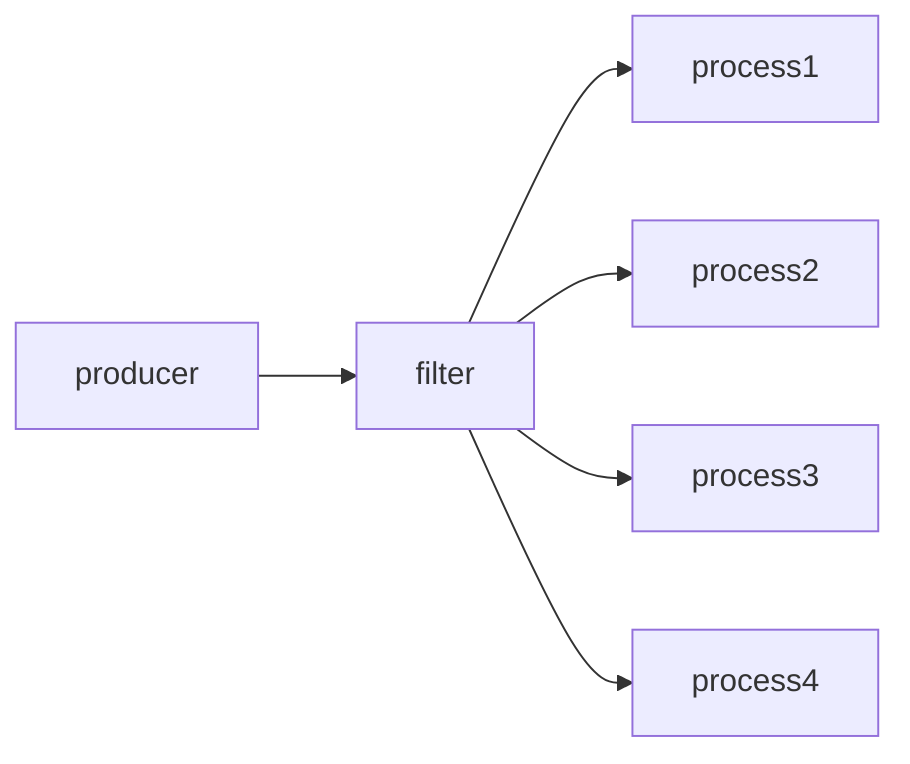

# Structured Shell Programming (Recursions, Lambdas, Concurrency, Functional Paradigms)

The proposition is simple: **`SHELL` is the most effective programming technique** you can learn, because it's based on **process composition**, it necessarily works at a **higher level** than say compared to Haskell.

All the code plus the original defcon604 slides are available at [my github](https://github.com/ms-jpq/defcon604-2023)

#### Haskell?

Building block: _Functions_

```haskell
functions . pointfree . compose
```

#### Shell

Building block: _Programs_

```bash
process1 | process2 | process3
```

My goals in this essay isn't to explore the quirks of the `SHELL` programming languages, of which there are many. Rather, this is a distillation of the useful **semantics of process composition**.

---

## Homoplasies to Structured / Functional / SQL Programming

There is a perception: that `$SHELL` programs are **unstructured**, **primitive**, and **impotent**.

While there is some truth to this, in that the majority of `$SHELL` programming is written rather haphazardly. It is nevertheless a misunderestimation of an entire paradigm.

<figure>
  
  <figcaption>
    yes I know <code>homology != homoplasy</code>, but <code>homology</code> has prettier illustrations on wikipedia
  <figcaption>
</figure>

- The pitch: **It is hard to perform recursion without some coherent structure, and underlying consistency**.

- Through both interesting and constructive examples (with **many recursions**), I will demonstrate the **homoplasies** that `$SHELL` programming has with other more regarded programming paradigms.

---

## Case Study: Recursive Bash HTTP Server

Before I bore you to death with practical knowledge, there is an _amusing amount of depth_ in this toy HTTP server.

For pedagogical purposes, this is my favorite program. Please allow me to break down the **_interesting bits_**.

```bash
#!/usr/bin/env -S -- bash -Eeu -O dotglob -O nullglob -O extglob -O failglob -O globstar

set -o pipefail

ADDR='127.0.0.1'
PORT='8888'
if [[ -t 0 ]]; then
  printf -- '%q ' curl -- "http://$ADDR":"$PORT"
  printf -- '\n'
  exec -- socat TCP-LISTEN:"$PORT,bind=$ADDR",reuseaddr,fork EXEC:"$0"
fi

tee <<-'EOF'
HTTP/1.1 200 OK

EOF

printf -- '%s\n' 'HELO' >&2
exec -- cat -- "$0"
```

### `#!`: shebang

```bash
#!/usr/bin/env -S -- bash -Eeu -O dotglob -O nullglob -O extglob -O failglob -O globstar
```

- In UNIX systems, `#!` are the magic bytes at beginning of files that denote executable scripts, and it leads to a path i.e. `/usr/bin/env` as the script interpreter. This is fairly well known.

- This isn't all that interesting, but what's less well known is that many `/usr/bin/env` implements have a `-S`, `--split-string` flag that splits the shebang line, allowing for succinct argument passing. For example, passing in `perl -CAS` to enable [greater Unicode support](https://manpages.ubuntu.com/manpages/noble/en/man1/perl.1.html).

### `[[ -t 0 ]]`: is stdin `(fd 0)` a terminal?

- The recursion here works by checking if the script is run from the terminal, if so, the script re-spawns itself under a child process of [`socat`](https://manpages.ubuntu.com/manpages/noble/en/man1/git.1.html), in which it is no longer attached to the terminal.

- The terminal is actually a fairly important concept for in shell programming, as it is the `$SHELL` itself. It poses some **compelling questions**:

1.  - On [`ASCII`](https://manpages.ubuntu.com/manpages/noble/en/man7/ascii.7.html) and strings: How do you _delete_ a character from the terminal, if the terminal is **just another process**? Surely `stdin` is _append only_.

    - As it turns out, `ASCII` has multiple deletion characters: `BS ('\b')` and `DEL`, what's better, it even has a `BEL ('\a')` character that will blink your terminal.

2.  - So are even the most basic 8bit strings really just text? Or should we view them as _instruction streams_?

    - The latter mental model should prove more fruitful for shell programming. (And understanding Unicode in general)

### `printf -- '%q '`: What kind of format is `%q`?

Two things are true:

1.  **Recursion is difficult without argument passing**.

2.  It is difficult to manually quote arguments in `$SHELL` languages.

#### The solution:

`%q ` **quotes arguments** to `printf` such that they can **`$SHELL` expand back to their logical identity**.

This feature is not unique to `bash` and `zsh`. We can examine a few more languages to reveal their idiosyncrasies:

- **Python**: The quoted string is the most legible of the bunch.

```python
from shlex import join

print(join(("\n ", "#$123", r"\@!-_")))
# '
#  ' '#$123' '\@!-_'
```

- **Ruby**: You can really see the `perl` heritage here, both in syntax and in library names.

```ruby
require 'shellwords'

puts %W[\n#{' '} \#$123 \\@!-_].map(&:shellescape).join ' '
# '
# '\  \#\$123 \\@\!-_
```

- **Bash**: Observe that the quoted string is **a single line**, unlike `python` and `ruby`. This is deliberate, since `bash` like other `$SHELL` languages is fundamentally **line / record oriented**. Line breaks carry special currency in `$SHELL`, and need to be used **judiciously**.

  - Note: this is _NOT POSIX compliant_, due to `$'<string>'` being a bash extension.

```bash
printf -- '%q ' $'\n ' '#$123' '\@!-_'
# $'\n'\  \#\$123 \\@\!-_
```

- **PowerShell**: Wow, such Microsoft, much `UTF16-LE`, very `BASE64`.

  - Note: For escaping in general, `printf -- %s "$STRING" | base64 -d | "$SHELL"` is never a bad strategy. Since `base64 -d` is fairly ubiquitous.

```ps1
# Must be UTF16-LE encoded
$pwsh = @"
...
"@
$argv = @(
  'powershell.exe'
  '-NoProfile'
  '-NonInteractive'
  '-WindowStyle', 'Hidden'
  '-EncodedCommand', [Convert]::ToBase64String([Text.Encoding]::Unicode.GetBytes($pwsh))
)
```

~~applescript is also a valid language, and you can `quoted form of`~~

### `exec -- socat TCP-LISTEN:"$PORT,bind=$ADDR",reuseaddr,fork EXEC:"$0"`

Three 🐓 (birds) one 🗿 (line).

- **`exec --`, `EXEC:`**: ["exec\*" family of _syscalls_](https://manpages.ubuntu.com/manpages/noble/en/man3/exec.3.html): **replace** current process with new process:

  - Analogous to tail call optimization when used for recursion.

  - As a consequence of this **short-circuiting** behavior, we can author syntactically valid multi-language scripts, i.e.:

#### Julia

- - As long `^#` is a part of the comment syntax.

```julia
#!/usr/bin/env -S -- bash -Eeuo pipefail -O dotglob -O nullglob -O extglob -O failglob -O globstar
#=
set -x
JULIA_DEPOT_PATH="$(mktemp)"
export -- JULIA_DEPOT_PATH
exec -- julia "$0" "$@"
=#

print(@__FILE__)
```

#### Rust

- - Some languages like JavaScript or Rust, specifically allow `#!` shebang even if the `#` is not part of the comment syntax.

    - Often, they will have `//` as the comment start, and due to `POSIX` path normalization, we can use `//usr/bin/true;` as a **NOOP**, followed by the actual script.

```rust
#!/usr/bin/env -S -- bash -Eeuo pipefail
//usr/bin/true; rustc --edition=2021 -o "${T:="$(mktemp)"}" -- "$0" && exec -a "$0" -- "$T" "$0" "$@"

#![deny(clippy::all, clippy::cargo, clippy::pedantic)]

fn main() {
// make build.rs executable!
}
```

#### Swift

- - In `BASH` specifically, `exec -a '<arg0>'` is used to set the **first argument** of the new process. Which conventionally is the **name of the executable**. (even under NT!)

    - This enables the polyglot script to _pass-through_ `argv[0]`.

```swift
#!/usr/bin/env -S -- bash -Eeuo pipefail
//usr/bin/true; swiftc -o "${TMPFILE:="$(mktemp)"}" -- "$0" && exec -a "$0" -- "$TMPFILE" "$@"

let arg0 = CommandLine.arguments.first!
print(arg0)
```

- **`$0`**: `argv[0]` (first argument)

  - Conventionally `ARGV[0]` is always present.

  - This has two important implications:

    1. Since we invoke programs by their name, we can use `ARGV[0]` to **perform recursion** as well as dispatch multi-call binaries like busybox.

    2. For scripts, conventionally the name of the script just happens to be the **path to itself**. This allows scripts have **knowledge of their own location**, and access resources relative to itself.

- **`fork`**: [`fork` is another _syscall_](https://manpages.ubuntu.com/manpages/noble/en/man3/fork.3posix.html). It **duplicates** the current process. That is to imply, ⇒ **parallelism**.

  - Since `$SHELL` programming is fundamentally **process oriented**, `fork` is the basis for concurrency, rather than threads, or coroutines.

  - Without `fork`, `socat` is unable to handle more than a single TCP connection.

### `tee <<-'EOF'`

`tee<<-'EOF'` is a _here-doc_, a special syntax that prints content between `EOF…EOF` to the `/dev/stdin` of `tee`. Notably, as a child of `socat`, `tee`'s `/dev/stdout` actually writes to the file descriptor of the **TCP socket** provisioned by `socat`.

- Recall the UNIX mantra: **everything is a file**, and that since files are IO streams, we can derive that **files are commutable with other files via IO streams**.

  - Since `std{in,out,err}` are blocking, process composition is blessed by **_implicit end to end back pressure_**.

- Files and **file systems** is a recurring theme in effective `$SHELL` programming, especially with regard to IPC.

  - Take advantage of POSIX atomic transactions: `rename`, `reflink`, `link`, `symlink`, `rename`, `mkdir`, `flock`, etc.

  - Take advantage of "consequence free" directories: [`tmpfs`](https://manpages.ubuntu.com/manpages/noble/en/man5/tmpfs.5.html) (RAM FS) - `/run`, `/tmp`

`HTTP/1.1 200 OK\r\n\r\n` is the minimal spec compliant HTTP response header, it must proceed any response body.

- Curiously we never used `\r\n` in the heredoc of our script, only `\n`, and yet the HTTP server is still functional.

  - Almost all HTTP clients tolerate "malformed" responses.

- Exploit The **Postel's law**: "Be conservative in what you do, be liberal in what you accept from others".

  - Take advantage of the UNIX world of emergent & ossified protocols.

---

## Recursion is cool, but who gives a shit

_Who the fuck_ uses **`$SHELL` recursion** on a daily basis?

Probably **(((you)))**, if you use `SSH`.

```bash
ssh '<user@host>' '…' '<arguments>' '…'
```

```bash
# SSH flow diagram, in a typical interactive scenario
"$SHELL" '->' ssh (client) '->' sshd (server) '->' "$SHELL"
```

However trivial the `ssh` client's arguments are, a login `$SHELL` → login `$SHELL` **recursion** always takes place, even in the degenerate case of zero arguments.

Percipiently, every argument passed to the local ssh client i.e. `'…' '<arguments>' '…'` are first **evaluated and expanded** by the local `$SHELL`, **and once more** by the remote `$SHELL`.

Thus, for non-trivial arguments ⇉ use `printf -- '%q '`.

### Emergent Protocol -- POSIX sh

Similar to how the ubiquity of `C` made its calling convention the universal [FFI API](https://doc.rust-lang.org/nomicon/ffi.html), the ubiquity of the [`int system(const char *command)`](https://manpages.ubuntu.com/manpages/noble/en/man3/system.3posix.html) has made the `POSIX` `$SHELL` an incidental standard API in of itself.

For any arbitrary `UNIX` program, if it has a mechanism for spawning processes as a single argument, chances are, the arguments to the parent program are carried over more or less verbatim into
the system `/bin/sh`, or via the `$SHELL` environ.

_i.e.:_

- [`FZF_DEFAULT_COMMAND='…', fzf --preview '…', fzf --execute '…'`](https://manpages.ubuntu.com/manpages/noble/man1/fzf.1.html): `fzf`'s preview, execute, and search commands.

- [`GIT_SSH_COMMAND='…' git`](https://manpages.ubuntu.com/manpages/noble/en/man1/git.1.html): pass args to `ssh` under `git`.

- [`PAGER='…', EDITOR='…', VISUAL='…'`](https://manpages.ubuntu.com/manpages/noble/en/man7/environ.7.html): various _standard environmental variables_.

- [`parallel -- '…'`](https://manpages.ubuntu.com/manpages/noble/en/man7/parallel_tutorial.7.html): gnu parallel straight up has a `--quote` command to help with escaping.

- [`rsync --rsh '…'`](https://manpages.ubuntu.com/manpages/noble/en/man1/rsync.1.html): `rsync`'s tunneling proxy process.

- [`ssh -o ProxyCommand='…'`](https://manpages.ubuntu.com/manpages/noble/en/man5/ssh_config.5.html): `ssh`'s tunneling command, i.e. `exec openssl s_client -quiet -connect '%h:%p' -servername "$SNI"`: SSL wrapping SSH, for SNI routing through TCP proxies like nginx.

..., and so on.

---

## `$SHELL` is built from lambdas??

_**YES: Almost everything in `$SHELL` outside of control flow and redirection is a pseudo-process**_

```txt
⠀⠀⠀⠀⠀⠀⠀⠀⠀⠀⠀⠀⠀⠀⠀⠀⠀⠀⠀⣀⣤⣤⣤⣶⣤⣤⣀⣀⣀⠀⠀⠀⠀⠀⠀⠀⠀⠀⠀⠀⠀⠀⠀⠀⠀⠀⠀⠀⠀⠀
⠀⠀⠀⠀⠀⠀⠀⠀⠀⠀⠀⠀⠀⠀⠀⠀⣠⣴⣿⣿⣿⣿⣿⣿⣿⣿⣿⣿⣿⣿⣶⣄⠀⠀⠀⠀⠀⠀⠀⠀⠀⠀⠀⠀⠀⠀⠀⠀⠀⠀
⠀⠀⠀⠀⠀⠀⠀⠀⠀⠀⠀⠀⠀⠀⢀⣾⣿⣿⣿⣿⣿⡿⠋⠉⠛⠛⠛⠿⣿⠿⠿⢿⣇⠀⠀⠀⠀⠀⠀⠀⠀⠀⠀⠀⠀⠀⠀⠀⠀⠀
⠀⠀⠀⠀⠀⠀⠀⠀⠀⠀⠀⠀⠀⠀⣾⣿⣿⣿⣿⣿⠟⠀⠀⠀⠀⠀⡀⢀⣽⣷⣆⡀⠙⣧⠀⠀⠀⠀⠀⠀⠀⠀⠀⠀⠀⠀⠀⠀⠀⠀
⠀⠀⠀⠀⠀⠀⠀⠀⠀⠀⠀⠀⠀⢰⣿⣿⣿⣿⣿⣷⠶⠋⠀⠀⣠⣤⣤⣉⣉⣿⠙⣿⠀⢸⡆⠀⠀⠀⠀⠀⠀⠀⠀⠀⠀⠀⠀⠀⠀⠀
⠀⠀⠀⠀⠀⠀⠀⠀⠀⠀⠀⠀⠀⢸⣿⣿⣿⣿⣿⠁⠀⠀⠴⡟⣻⣿⣿⣿⣿⣿⣶⣿⣦⡀⣇⠀⠀⠀⠀⠀⠀⠀⠀⠀⠀⠀⠀⠀⠀⠀
⠀⠀⠀⠀⠀⠀⠀⠀⠀⠀⠀⠀⠀⢨⠟⡿⠻⣿⠃⠀⠀⠀⠻⢿⣿⣿⣿⣿⣿⠏⢹⣿⣿⣿⢿⡇⠀⠀⠀⠀⠀⠀⠀⠀⠀⠀⠀⠀⠀⠀
⠀⠀⠀⠀⠀⠀⠀⠀⠀⠀⠀⠀⠀⣿⣼⣷⡶⣿⣄⠀⠀⠀⠀⠀⢉⣿⣿⣿⡿⠀⠸⣿⣿⡿⣷⠃⠀⠀⠀⠀⠀⠀⠀⠀⠀⠀⠀⠀⠀⠀
⠀⠀⠀⠀⠀⠀⠀⠀⠀⠀⠀⠀⠀⢻⡿⣦⢀⣿⣿⣄⡀⣀⣰⠾⠛⣻⣿⣿⣟⣲⡀⢸⡿⡟⠹⡆⠀⠀⠀⠀⠀⠀⠀⠀⠀⠀⠀⠀⠀⠀
⠀⠀⠀⠀⠀⠀⠀⠀⠀⠀⠀⠀⠀⠀⢰⠞⣾⣿⡛⣿⣿⣿⣿⣰⣾⣿⣿⣿⣿⣿⣿⣿⣿⡇⢰⡇⠀⠀⠀⠀⠀⠀⠀⠀⠀⠀⠀⠀⠀⠀
⠀⠀⠀⠀⠀⠀⠀⠀⠀⠀⠀⠀⠀⠀⠘⠀⣿⡽⢿⣿⣿⣿⣿⣿⣿⣿⣿⣿⣿⢿⠿⣍⣿⣧⡏⠀⠀⠀⠀⠀⠀⠀⠀⠀⠀⠀⠀⠀⠀⠀
⠀⠀⠀⠀⠀⠀⠀⠀⠀⠀⠀⠀⠀⠀⠀⠀⣿⣷⣿⣿⣿⣿⣿⣿⣿⣿⣷⣮⣽⣿⣷⣙⣿⡟⠀⠀⠀⠀⠀⠀⠀⠀⠀⠀⠀⠀⠀⠀⠀⠀
⠀⠀⠀⠀⠀⠀⠀⠀⠀⠀⠀⠀⠀⠀⠀⠀⠙⢿⣿⣿⣿⣿⣿⣿⣿⣿⣿⣿⣿⣿⡟⣹⡿⠇⠀⠀⠀⠀⠀⠀⠀⠀⠀⠀⠀⠀⠀⠀⠀⠀
⠀⠀⠀⠀⠀⠀⠀⠀⠀⠀⠀⠀⠀⠀⠀⠀⠀⠀⠈⠛⢿⣿⣿⣿⣿⣿⣿⣿⣿⣿⣿⣿⡧⣦⠀⠀⠀⠀⠀⠀⠀⠀⠀⠀⠀⠀⠀⠀⠀⠀
⠀⠀⠀⠀⠀⠀⠀⠀⠀⠀⠀⠀⢠⡆⠀⠀⠀⠀⠀⠀⠀⠉⠻⣿⣿⣾⣿⣿⣿⣿⣿⣿⡶⠏⠀⠀⠀⠀⠀⠀⠀⠀⠀⠀⠀⠀⠀⠀⠀⠀
⠀⠀⠀⠀⠀⠀⠀⣀⣠⣤⡴⠞⠛⠀⠀⠀⠀⠀⠀⠀⠀⠀⠀⠚⣿⣿⣿⠿⣿⣿⠿⠟⠁⠀⠀⠀⠀⠀⠀⠀⠀⠀⠀⠀⠀⠀⠀⠀⠀⠀
⠀⢀⣠⣤⠶⠚⠉⠉⠀⢀⡴⠂⠀⠀⠀⠀⠀⠀⠀⠀⢠⠀⠀⢀⣿⣿⠁⠀⡇⠀⠀⠀⠀⠀⠀⠀⠀⠀⠀⠀⠀⠀⠀⠀⠀⠀⠀⠀⠀⠀
⠞⠋⠁⠀⠀⠀⠀⣠⣴⡿⠃⠀⠀⠀⠀⠀⠀⠀⠀⠀⣾⠀⠀⣾⣿⠋⠀⢠⡇⠀⠀⠀⠀⠀⠀⠀⠀⠀⠀⠀⠀⠀⠀⠀⠀⠀⠀⠀⠀⠀
⡀⠀⠀⢀⣷⣶⣿⣿⣿⡇⠀⠀⠀⠀⠀⠀⠀⠀⠀⠀⣿⣆⣼⣿⠁⢠⠃⠈⠓⠦⣄⡀⠀⠀⠀⠀⠀⠀⠀⠀⠀⠀⠀⠀⠀⠀⠀⠀⠀⠀
⣿⣿⡛⠛⠿⠿⠿⠿⠿⢷⣦⣤⣤⣤⣦⣄⣀⣀⠀⢀⣿⣿⠻⣿⣰⠻⠀⠸⣧⡀⠀⠉⠳⣄⠀⠀⠀⠀⠀⠀⠀⠀⠀⠀⠀⠀⠀⠀⠀⠀
⠛⢿⣿⣆⠀⠀⠀⠀⠀⠀⠀⠀⠈⠉⠉⠙⠛⠿⣦⣼⡏⢻⣿⣿⠇⠀⠁⠀⠻⣿⠙⣶⣄⠈⠳⣄⡀⠀⠀⠀⠀⠀⠀⠀⠀⠀⠀⠀⠀⠀
⠀⠀⠈⠋⠀⠀⠀⠀⠀⠀⠀⠀⠀⠀⠁⣐⠀⠀⠀⠈⠳⡘⣿⡟⣀⡠⠿⠶⠒⠟⠓⠀⠹⡄⢴⣬⣍⣑⠢⢤⡀⠀⠀⠀⠀⠀⠀⠀⠀⠀
⠀⠀⠀⠀⠀⠀⠀⠀⠀⠀⠀⠀⠀⠀⠀⠙⢀⣀⠐⠲⠤⠁⢘⣠⣿⣷⣦⠀⠀⠀⠀⠀⠀⠙⢿⣿⣏⠉⠉⠂⠉⠉⠓⠒⠦⣄⡀⠀⠀⠀
⠀⠀⠀⠀⠀⠀⠀⠀⠀⠀⠀⠀⠀⠀⠀⠀⠀⠉⠀⠀⠀⠀⠈⣿⣿⣷⣯⠀⠀⠀⠀⠀⠀⠀⠀⠉⠻⢦⣷⡀⠀⠀⠀⠀⠀⠀⠉⠲⣄⠀
⠠⠀⠀⠀⠀⠀⠀⠀⠀⠀⠀⠀⠀⠀⠀⠀⠀⠀⠀⠀⠘⢦⠀⢹⣿⣏⠀⠀⠀⠀⠀⠀⠀⠀⠀⠀⠀⠀⠙⢻⣷⣄⠀⠀⠀⠀⠀⠀⠈⠳
⠀⠀⠁⠀⠀⠀⠀⠀⠀⠀⠀⠀⠀⠀⠀⠀⠀⠀⠀⠀⠀⠀⠁⣸⣿⣿⡀⠀⠀⠀⠀⠀⠀⠀⠀⠀⠀⠀⠀⠀⠈⣽⡟⢶⣄⠀⠀⠀⠀⠀
⠯⠀⠀⠀⠒⠀⠀⠀⠀⠀⠐⠀⠀⠀⠀⠀⠀⠀⠀⠀⠀⠀⠀⢻⣿⣿⣷⣄⠀⠀⠀⠀⠀⠀⠀⠀⠀⠀⠀⠀⠀⢸⣿⡄⠈⠳⠀⠀⠀⠀
⠀⠀⢀⣀⣀⡀⣼⣤⡟⣬⣿⣷⣤⣀⣄⣀⡀⠀⠀⠀⠀⠀⠀⠈⣿⣿⡄⣉⡀⠀⠀⠀⠀⠀⠀⠀⢀⠀⠀⠀⠀⠀⣿⣿⣄⠀⣀⣀⡀⠀
```

### Case Study: `process1 | process2 | λ | process3{4*}`

**Objective:** I want to defragment a [btrfs file system](https://btrfs.readthedocs.io), which have arbitrary subvolumes.

**Challenges:**

1. `btrfs defragment -r -- '…'` is not recursive for btrfs [subvolumes](https://btrfs.readthedocs.io/en/latest/Subvolumes.html).

2. `btrfs subvolume list -- '…'` has no filter for readonly (undefragable) subvolumes.

**Solution:**

- **`process1 | process2`**: List all subvolumes.

- **`lambda`**: Print path of subvolume, unless subvolume is readonly.

- **`process3{4*}`**: Concurrently, for each printed subvolume, defragment.

```bash
set -o pipefail

SUBVOLUME="$1"
LIST=(btrfs subvolume list -- "$SUBVOLUME")
PICK=(cut --delimiter ' ' --fields 9-)
PARALLEL=(xargs --no-run-if-empty --null -I % --max-procs 0 --)
DEFRAG=(btrfs -v filesystem defragment -r -- %)

{
  printf -- '%s\0' "$SUBVOLUME"
  "${LIST[@]}" | "${PICK[@]}" | while read -r -- VOL; do
    VOL="$SUBVOLUME/$VOL"
    if btrfs property get -- "$VOL" ro | grep --fixed-strings --quiet -- 'ro=false'; then
      printf -- '%s\0' "$VOL"
    fi
  done
} | "${PARALLEL[@]}" "${DEFRAG[@]}"
```

### `λ` as Control Flow

Notice the following:

1. The `while <condition>` tests for a `$SHELL` built-in, `read -- VOL`, which assigns each row into the `$VOL` variable.

   - When no more lines can be assigned. `read` **returns 1**

2. The `if <condition>` tests the exit code of the `btrfs … | grep …` pipeline.

   - When either `btrfs …` or `grep …` **exits non-zero**, the `if` condition evaluates to [`false`](https://manpages.ubuntu.com/manpages/noble/en/man1/false.1.html).

Wait a minute, **why is there a link on `false`**???

Recall the section in polyglot scripts, where we used [`//usr/bin/true`](https://manpages.ubuntu.com/manpages/noble/en/man1/true.1.html) as a NOOP, because it always exits 0, likewise `false` ⇾ `/usr/bin/false`, always exit 1.

- **Conditions in `$SHELL` are just `λ` exit codes**

  - 0: Success, !0: Failure

- Almost all built-ins in `$SHELL` has an exit code → part of being pseudo-processes.

  - `/usr/bin/true`, `/usr/bin/false`, [`/bin/test`](https://manpages.ubuntu.com/manpages/noble/en/man1/test.1.html), `/bin/[` (of `[ -f "$FILE" ]`) exist because some `$SHELL` don't even bother to implement them.

### `λ` IO

Notice that the **`while` loop is fact capable of piped IO**. We can even redirect it's output into other processes.

- Conceptually, `$SHELL` loops can be seen as stream transformers, similar to generators say in `python` or `ruby`.

- Similarly, most `$SHELL` constructs are also IO capable pseudo-processes, hence the **`λ`** designation.

### Extrapolate with Recursions

#### Try-Catch Error Handling

Typical golden path `$SHELL` script.

- Set `$SHELL` to early abort for unhandled `non-zero` exits.

  - Analogous to `throwing` on exceptions.

  - If final exit code is `0`, great success!

- Alternative is the equivalent of `if err != nil` for every fallible statement, 🤮

```txt
`tree -- ./4-pipeline`

./4-pipeline
└── are we on track?
    ├── 0
    │   └── are we on track?
    │       ├── 0
    │       │   └── are we on crack?
    │       │       ├── 0
    │       │       │   └── ☠️ -> ../../../../../1/☠️
    │       │       └── 1
    │       │           └── are we on track?
    │       │               ├── 0
    │       │               │   └── 💅
    │       │               └── 1
    │       │                   └── ☠️ -> ../../../../../../../1/☠️
    │       └── 1
    │           └── ☠️ -> ../../../1/☠️
    └── 1
        └── ☠️

12 directories, 5 files
```

- Wrap `<fallible code>` with `if`.

  - Recall _processes are like functions_.

```bash
if ! [[ -v RECUR ]]; then
  if UNDER=1 "$0" "$@"; then
    # .then(() => {})
  else
    # .catch(() => {})
  fi
else
  # fallible code
fi
```

#### Fan-out Concurrency

- Unify producer & processor pipeline in single script



- We can extrapolate using `RECUR=2`, `RECUR=3` and so forth to for additional pipeline stages.

  - Use [`gnuparallel`](https://manpages.ubuntu.com/manpages/noble/en/man7/parallel_tutorial.7.html) for fan-in, anything else probably sucks.

```bash
PRODUCE=(...)
FANOUT=(xargs --no-run-if-empty --null --max-args 1 --max-procs 0 --)

if ! [[ -v RECUR ]]; then
  "${PRODUCE[@]}" | while read -r -d '' -- RECORD; do
  # filter
  done | RECUR=1 "${FANOUT[@]}" "$0" "$@"
else
  # consume
fi
```

---

## Homoplasies to Structured Concurrency

Taking a leaf out of the excellent essay by Nathaniel J. Smith's of python's [trio async framework](https://github.com/python-trio/trio):

[Notes on structured concurrency, or: Go statement considered harmful](https://vorpus.org/blog/notes-on-structured-concurrency-or-go-statement-considered-harmful/)

- ~~Functions~~ processes are the core constituents of structured programming:

- stack unwinding ↔ process termination ⇉ guaranteed resource deallocation

- absence of `goto` ↔ isolated resource space ⇉ localization of failure modes / reasonability

- consolidation of concurrent execution

  - conservation of abstraction

    - **pipes are monoids** in the category of processes

      - `cat, tee` are the identity operators

  - conservation of [signal](https://manpages.ubuntu.com/manpages/noble/en/man2/signal.2.html) cascades

    - Robust handling of UNIX [signals & process termination](https://catern.com/process.html) in general is a

### Data Types

## Homoplasies to Logical Programming

What if Prolog had no backtracking?

## Homoplasies to Functional Programming

### Referential Transparency

---

## You can write ~~Java~~ `$SHELL` in any language

I wrote the sameish `$SHELL` program in [15 languages](https://github.com/ms-jpq/defcon604-2023/tree/main/5-helo), with some [remarks on each language](https://github.com/ms-jpq/defcon604-2023/blob/main/JAVA.md).

---

## Acknowledgements

Thank you so much to my employer [Graveflex]() and especially my Boss (with capital B) [Lynn Hurley]() for providing an environment where I was able to nature my skills as a programmer :).
